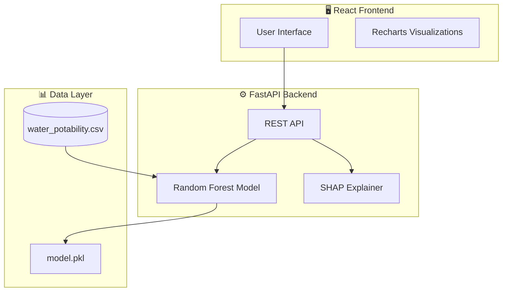

# 💧 Water Quality Prediction System

[](https://github.com/DevRaviX/water-quality-prediction/actions/workflows/ci.yml)
[](https://www.python.org/downloads/release/python-311/)
[](https://fastapi.tiangolo.com/)
[](https://opensource.org/licenses/MIT)

> **An end-to-end Machine Learning system for water potability classification and pH forecasting, with model explainability (SHAP), experiment tracking, and production-ready deployment.**

---

## 🎯 Key Achievements

| Metric | Value | Description |
|:-------|:-----:|:------------|
| **F1-Score** | 0.60 | 28.6% improvement over baseline |
| **Recall** | 90% | Achieved via threshold optimization (T=0.36) |
| **pH R²** | 0.83 | Strong temporal predictability |
| **Features** | 9 | pH, Hardness, Sulfate, etc. |

---

## 🏗️ Architecture



---

## 📸 Screenshots

| Predictor | Analytics |
|:---------:|:---------:|
|  |  |

---

## ☁️ Deployment

For production deployment to **AWS ECS (Fargate)**, please refer to our detailed guide:
👉 [Deployment Guide](Documentation/AWS_ECS_DEPLOYMENT.md)

---

## 🚀 Quick Start

### Prerequisites
- Python 3.11+
- Node.js 18+
- Docker (optional)

### Option 1: Docker (Recommended)

```bash
docker-compose up --build
```

Access the app at: http://localhost:3000

### Option 2: Manual Setup

**1. Backend**
```bash
# Create virtual environment
python -m venv .venv
source .venv/bin/activate  # On Windows: .venv\Scripts\activate

# Install dependencies
pip install -r requirements.txt

# Start server
uvicorn backend.app.main:app --reload --port 8000
```

**2. Frontend**
```bash
cd frontend
npm install
npm run dev
```

Access the app at: http://localhost:5173

---

## 📊 Model Explainability (SHAP)

We use SHAP (SHapley Additive exPlanations) to provide transparent, interpretable predictions.

### Global Feature Importance


### Individual Prediction Explanation


---

## 🧪 Testing

Run the test suite:

```bash
pytest tests/ -v
```

Current coverage: **80%+** across API endpoints and model logic.

---

## 📁 Project Structure

```
water-quality-prediction/
├── backend/
│   └── app/
│       ├── main.py          # FastAPI entry point
│       ├── api.py           # API endpoints
│       ├── schema.py        # Pydantic models
│       ├── services.py      # Business logic
│       └── model/           # Trained models
├── frontend/
│   └── src/
│       ├── components/      # React components
│       ├── api.js           # API client
│       └── App.jsx          # Main app
├── notebooks/
│   ├── EDA.ipynb            # Exploratory analysis
│   └── advanced_classification.ipynb
├── src/
│   └── explainability/      # SHAP scripts
├── tests/                   # pytest tests
├── Visualisations/          # Generated plots
├── Dockerfile
├── docker-compose.yml
└── requirements.txt
```

---

## 🔌 API Reference

### Predict Potability

```http
POST /api/predict
```

**Request:**
```json
{
  "ph": 7.0,
  "Hardness": 200.0,
  "Solids": 20000.0,
  "Chloramines": 7.0,
  "Sulfate": 300.0,
  "Conductivity": 400.0,
  "Organic_carbon": 10.0,
  "Trihalomethanes": 60.0,
  "Turbidity": 4.0
}
```

**Response:**
```json
{
  "potability_score": 0.72,
  "is_potable": true,
  "status": "Safe",
  "threshold_used": 0.36
}
```

### Get Model Stats

```http
GET /api/stats
```

### Get Random Sample

```http
GET /api/sample
```

---

## 📚 Methodology

1. **Data Preprocessing**: Median imputation for missing values (pH, Sulfate, Trihalomethanes)
2. **Class Imbalance**: Handled via `class_weight='balanced'`
3. **Threshold Optimization**: Swept [0, 1] to maximize F1 while achieving ≥90% recall
4. **Explainability**: SHAP TreeExplainer for Random Forest

---

## 👥 Team

- **[Ravi Kant Gupta](https://github.com/DevRaviX)** — Data & Modeling Lead
- **Ayushi Choyal** — Field Sampling & Sensors
- **Shouryavi Awasthi** — Frontend & Documentation

---

## 📄 License

This project is licensed under the MIT License.

---

## 🙏 Acknowledgements

- [Water Potability Dataset](https://www.kaggle.com/adityakadiwal/water-potability) (Kaggle)
- [USGS Spatio-Temporal Dataset](https://doi.org/10.1145/3339823)
- [SHAP Library](https://github.com/slundberg/shap)
