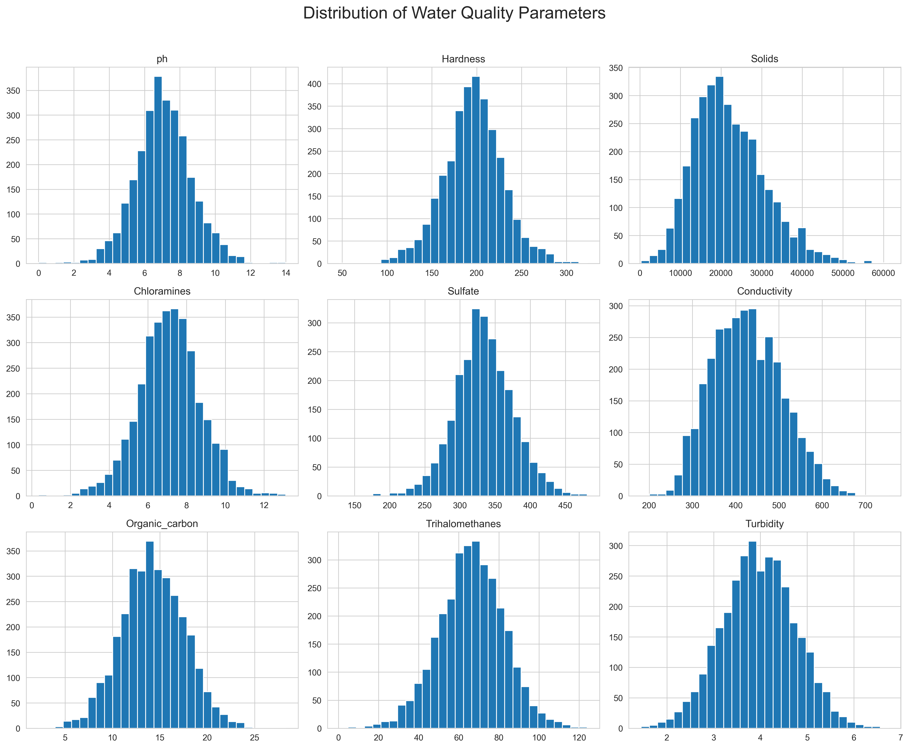
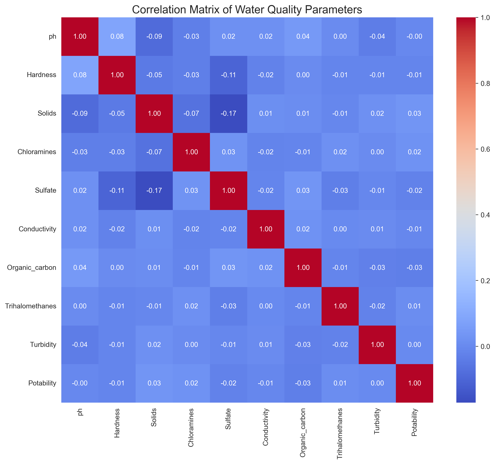
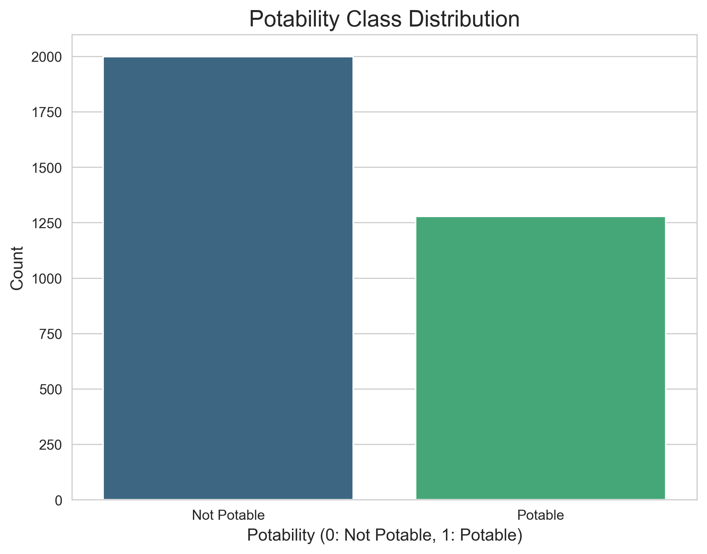
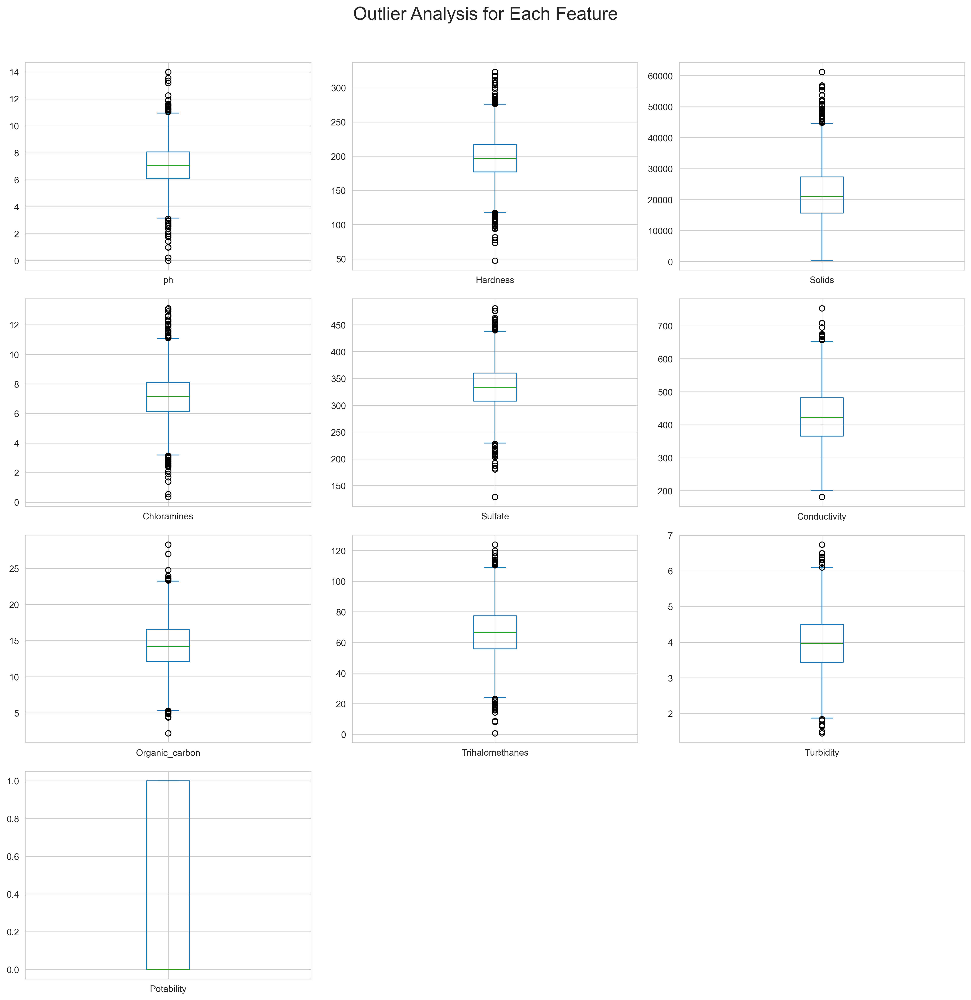
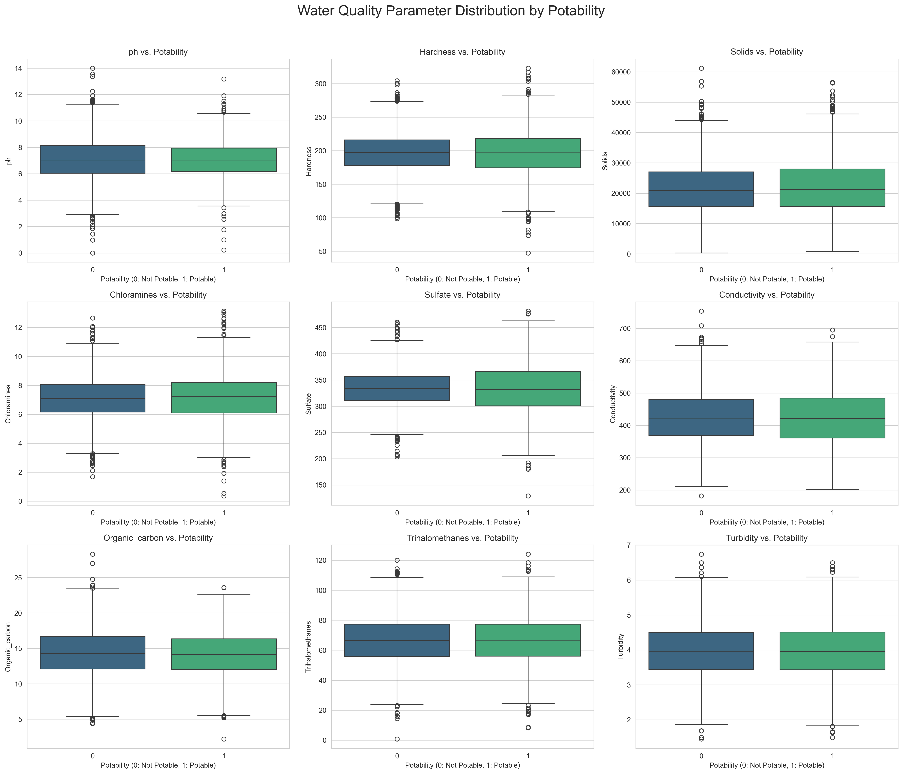
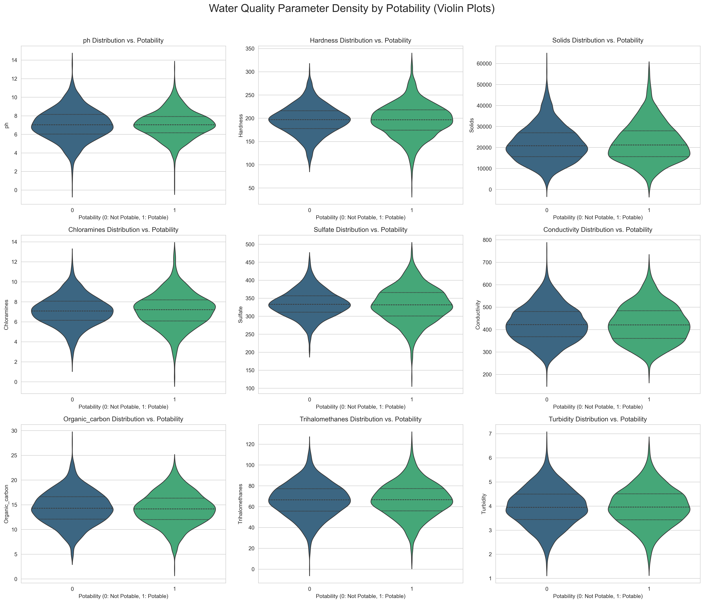
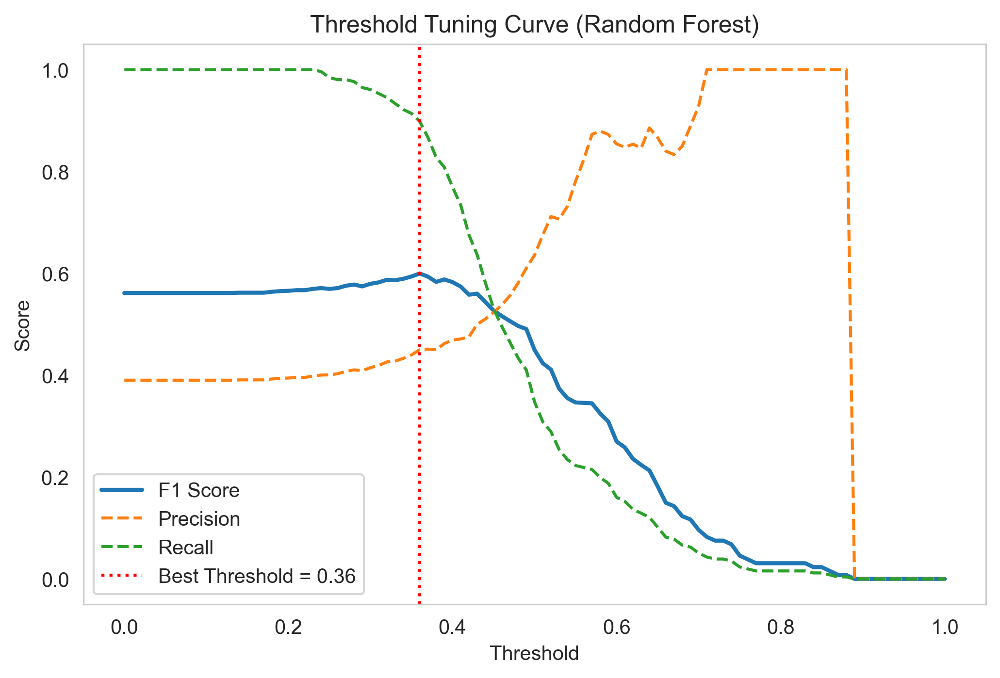
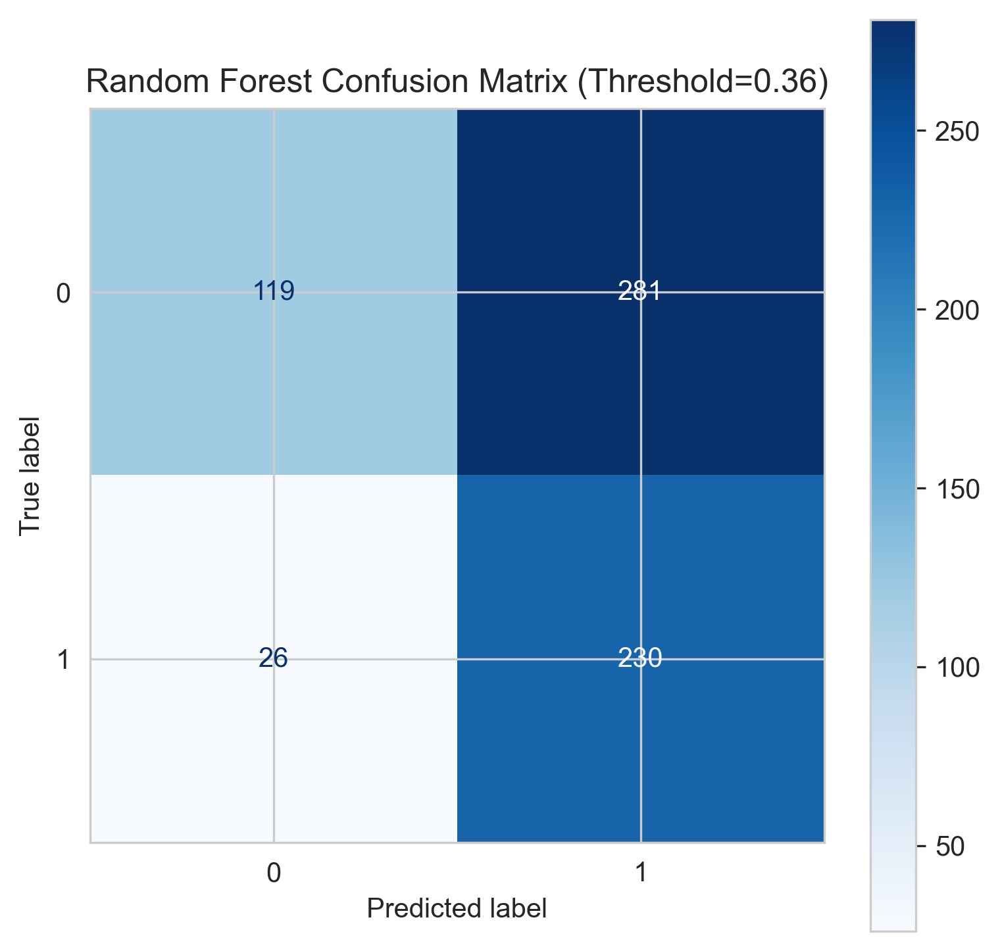
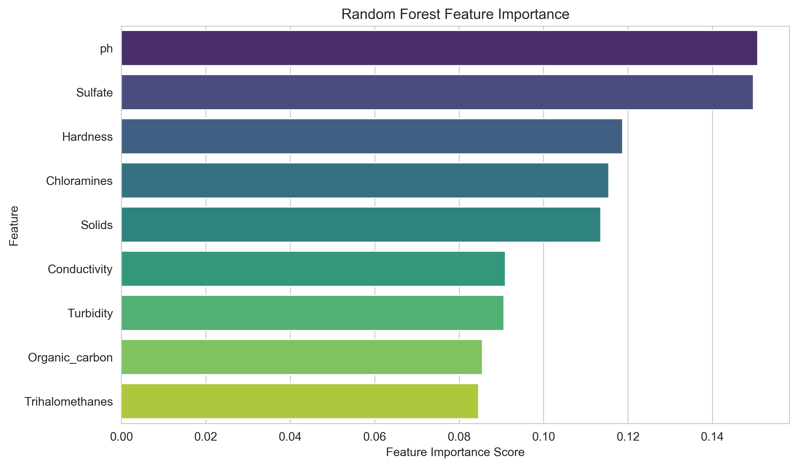

# 💧 Water Quality Prediction in Kurukshetra  
### Final Report — Machine Learning Semester Project (MCA, NIT Kurukshetra)

**Team Members:**  
- **Ravi Kant Gupta (524410027)** — Data & Modeling Lead  
- **Ayushi Choyal (524410017)** — Field Sampling & Sensors  
- **Shouryavi Awasthi (524410028)** — Frontend, Deployment & Documentation  

**Submission Date:** 3 November 2025  
**Institution:** Department of Computer Applications, NIT Kurukshetra  

---

## Abstract

This project presents a machine learning–based approach to predicting water potability and forecasting pH variations for water sources in and around Kurukshetra.  
The study aims to support public health monitoring by providing rapid, data-driven insights into water quality, reducing dependence on time-intensive laboratory testing.

Two complementary tasks were addressed: (1) binary classification of potable versus non-potable water samples using the **Water Potability Dataset (Kaggle)**, and (2) regression-based pH forecasting using a **spatio-temporal dataset** derived from the United States Geological Survey (USGS).  
After extensive exploratory data analysis and cleaning, a baseline Logistic Regression model achieved an F1-score of 0.4666.  
Through **threshold optimization**, the Random Forest model improved to an **F1-score of 0.5997**, surpassing the baseline by 28.6%.  
For pH forecasting, a linear regression model achieved **R² = 0.8329**, demonstrating strong temporal predictability.

The results confirm that explainable ensemble methods, coupled with threshold calibration, can substantially enhance classification performance in imbalanced environmental datasets.

---

# Table of Contents
1. [Introduction](#1-introduction)  
2. [Dataset Description](#2-dataset-description)  
3. [Methodology](#3-methodology)  
4. [Results and Discussion](#4-results-and-discussion)  
5. [Key Conclusions](#5-key-conclusions)  
6. [Reflections on Collaboration](#6-reflections-on-collaboration)  
7. [Impact and Use of AI Tools](#7-impact-and-use-of-ai-tools)  
8. [Academic Integrity and AI Tools Declaration](#8-academic-integrity-and-ai-tools-declaration)  
9. [References](#9-references)

---

## 1. Introduction

### 1.1 Background and Motivation
Water quality is a critical determinant of human health and agricultural sustainability. Conventional laboratory-based testing is reliable but time-consuming and resource-intensive. In regions like Kurukshetra, where groundwater serves both agricultural and domestic needs, there is a need for intelligent, real-time predictive systems that can infer water quality using low-cost sensor and environmental data.

### 1.2 Problem Statement
This study addresses two challenges:
1. **Classification:** Predicting whether a given water sample is potable (safe for drinking).  
2. **Regression:** Forecasting pH variations over time from spatio-temporal datasets.

### 1.3 Objectives and Scope
- Build an explainable machine learning pipeline for water quality prediction.  
- Implement linear and ensemble models for both classification and regression.  
- Handle data imbalance and optimize model thresholds.  
- Provide interpretable insights using feature importance and SHAP-style analysis.  

---

## 2. Dataset Description

### 2.1 Data Sources
1. **Water Potability Dataset** — Kaggle (Aditya Kadiwal, 2020).  
2. **Spatio-Temporal Dataset** — USGS (Zhao et al., 2019).

### 2.2 Feature Schema
The dataset includes:  
`pH`, `Hardness`, `Solids`, `Chloramines`, `Sulfate`, `Conductivity`, `Organic Carbon`, `Trihalomethanes`, `Turbidity`, and target label `Potability`.

### 2.3 Data Preprocessing
- Median imputation for missing values (`pH`, `Sulfate`, `Trihalomethanes`).  
- Stratified 80/20 train-test split to preserve class ratio (61% : 39%).  
- StandardScaler applied for linear models only.  
- Class imbalance handled via `class_weight='balanced'`.

---

## 2.4 Exploratory Data Analysis (EDA)

**Figure 1. Feature Histograms**  
_Distribution of each chemical property in the dataset._  

**Figure 2. Correlation Heatmap**  
_Identifies relationships between features affecting potability._  

**Figure 3. Potability Class Distribution**  
_Illustrates the dataset imbalance (61% Not Potable vs 39% Potable)._  

**Figure 4. Feature Boxplots**  
_Depicts feature spread and possible outliers._  

**Figure 5. All Features vs Potability (Boxplots)**  
_Shows how feature values differ between potable and non-potable samples._  

**Figure 6. All Features vs Potability (Violin Plots)**  
_Provides density-based visual comparison between classes._  

---

## 3. Methodology

### 3.1 Baseline Model — Logistic Regression
A Logistic Regression model with `class_weight='balanced'` served as the benchmark.  
**Results:**  
- F1-score = **0.4666**  
- ROC-AUC = **0.5475**  
- Accuracy = **0.53**

This performance set the quantitative target for later models.

---

### 3.2 Advanced Models — Random Forest & XGBoost
Two non-linear ensemble models were tested:
- **Random Forest:** 300 trees, depth = 12, class-balanced weights.  
- **XGBoost:** Configured with `scale_pos_weight = 1.56` for imbalance adjustment.  

These aimed to capture non-linear patterns missed by the baseline.

---

### 3.3 Spatio-Temporal Regression (pH Forecasting)
The `.mat` dataset (15,651 observations) was converted into a supervised structure.  
A simple **Linear Regression** achieved:
- **R² = 0.8329**
- **RMSE = 0.0120**

This validated strong temporal dependencies in pH values.

---

## 4. Results and Discussion

### 4.1 Baseline Model Performance

| Model | F1 (Potable=1) | ROC-AUC | Remarks |
|:------|:----------------|:--------|:--------|
| Logistic Regression | 0.4666 | 0.5475 | Serves as benchmark |

---

### 4.2 Classification Threshold Optimization — Random Forest

Default threshold (0.5) penalized recall.  
A sweep of thresholds [0–1] revealed the **best cut-off at T = 0.36**, yielding an F1-score of **0.5997**, improving the baseline by +28.6%.

| Metric | Not Potable (0) | Potable (1) |
|:--------|:----------------|:------------|
| Precision | 0.82 | 0.45 |
| Recall | 0.30 | **0.90** |
| F1-Score | 0.44 | **0.60** |
| Accuracy | 0.53 |
| ROC-AUC | 0.6765 |

---

### 🔹 Model Visualisations

**Figure 7. Threshold Tuning Curve (Random Forest)**  
_Depicts the trade-off between Precision, Recall, and F1._  

**Figure 8. Confusion Matrix (Threshold = 0.36)**  
_Confirms high recall for Potable class (230/256 correctly identified)._  

**Figure 9. Random Forest Feature Importance**  
_Top three predictors: pH, Sulfate, and Hardness._  

---

### 4.3 Regression Results — pH Forecasting

| Metric | Score | Interpretation |
|:--------|:------:|:--------------|
| R² | 0.8329 | Linear model explains >83% of pH variance. |
| RMSE | 0.012 | Low prediction error — high temporal consistency. |

---

## 5. Key Conclusions
1. Random Forest with threshold tuning achieved **F1 = 0.5997**, surpassing the baseline (+28.6%).  
2. Classification threshold optimization proved essential for imbalanced data.  
3. Regression analysis achieved **R² = 0.83**, confirming strong predictive relationships.  
4. Feature importance aligned with hydro-chemical understanding: **pH**, **Sulfate**, and **Hardness** dominate potability.  

---

## 6. Reflections on Collaboration
- **Ravi Kant Gupta:** Data processing, modeling, and reporting.  
- **Ayushi Choyal:** Field data and preprocessing.  
- **Shouryavi Awasthi:** Dashboard and presentation materials.  

The team maintained reproducibility using GitHub commits and Colab synchronization.

---

## 7. Impact and Use of AI Tools
ChatGPT (OpenAI GPT-5) was used responsibly for:
- Report formatting and grammar refinement.  
- Markdown structure and code commenting.  

All experiment code, model training, and evaluation were implemented independently by the team.

---

## 8. Academic Integrity and AI Tools Declaration

| Tool / Resource | Purpose | License |
|:----------------|:---------|:--------|
| ChatGPT (GPT-5) | Documentation & code clarification | OpenAI API |
| scikit-learn | Model training & evaluation | BSD |
| XGBoost | Boosted ensemble modeling | Apache 2.0 |
| Pandas / NumPy | Data processing | BSD |
| Seaborn / Matplotlib | Visualization | MIT |

**Datasets:**  
- *Water Potability Dataset (Kaggle, 2020)*  
- *Spatial Auto-regressive Dataset (ACM TSAS, 2019)*  

All references have been properly cited.

---

## 9. References

1. L. Zhao, O. Gkountouna, and D. Pfoser,  
   “Spatial Auto-regressive Dependency Interpretable Learning Based on Spatial Topological Constraints,” *ACM TSAS*, vol. 5, no. 3, 2019.  
2. A. Kadiwal, *Water Potability Dataset*, Kaggle, 2020.  
3. World Health Organization, *Guidelines for Drinking-Water Quality*, 4th Ed., 2017.  
4. T. Chen and C. Guestrin, “XGBoost: A Scalable Tree Boosting System,” *KDD*, 2016.  
5. Scikit-learn Developers, *Machine Learning in Python*, [https://scikit-learn.org/](https://scikit-learn.org/)  
6. M. Waskom, “Seaborn: Statistical Data Visualization,” *JOSS*, 2021.  
7. J. Hunter, “Matplotlib: A 2D Graphics Environment,” *CiSE*, 2007.  
8. W. McKinney, “Data Structures for Statistical Computing in Python,” *SciPy Conference*, 2010.  
9. C. R. Harris et al., “Array Programming with NumPy,” *Nature*, 2020.

---

**End of Report**
